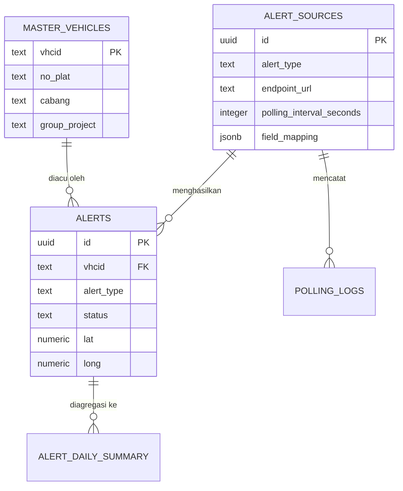

# PRD — Alert Centre Monitoring (ACM)

**Versi:** 1.0
**Status:** Draft untuk review
**Pemilik Produk:** Hajir — PT. Bumi Jasa Utama (BJU), Kalla Transport & Logistics Group

---

## 1. Latar Belakang

BJU memiliki akses ke berbagai API TMS EASYGO yang masing-masing merepresentasikan satu jenis alert operasional armada (mis. overspeed, geofence violation, idle time berlebih, dll). Saat ini belum ada satu platform yang mengonsolidasikan seluruh jenis alert ini menjadi satu dashboard realtime untuk control room, dengan referensi unit kendaraan yang konsisten (VHCID).

ACM dibangun untuk mengisi kebutuhan ini: satu platform konfiguratif yang bisa menerima sumber alert baru tanpa perlu deploy ulang kode, menormalisasi data ke satu skema umum berbasis VHCID, dan menyajikannya secara realtime ke ruang kontrol yang mengawasi 1000+ armada.

## 2. Tujuan

1. Mengonsolidasikan seluruh alert dari berbagai API TMS EASYGO ke satu dashboard realtime.
2. Memungkinkan penambahan sumber API alert baru sepenuhnya melalui UI (endpoint, token, interval, mapping field) tanpa perubahan kode backend.
3. Menyediakan data referensi unit kendaraan (Master Data VHCID) yang bisa diimpor dan digunakan untuk memperkaya (enrich) setiap alert yang masuk.
4. Mendukung operasional control room: workflow acknowledgement/close alert, visual khusus wall display, dan peta lokasi per kejadian.
5. Menyediakan laporan ringkasan (mingguan/bulanan) untuk level Management tanpa membebani performa sistem.
6. Menjaga sistem tetap berjalan di infrastruktur berbiaya rendah pada Fase 1, dengan jalur migrasi yang jelas ke infrastruktur lebih besar di Fase 2.

## 3. Ruang Lingkup

### Termasuk (Fase 1 / MVP)
- Modul konfigurasi sumber API alert (dinamis, termasuk token & interval polling)
- Modul Master Data VHCID (CRUD + import massal)
- Scheduler otomatis mengikuti konfigurasi per sumber
- Normalisasi alert berbasis VHCID + koordinat lat/long
- Dashboard realtime untuk control room (feed alert + grafik event)
- Modul kesehatan API (monitoring status polling)
- Modul heatmap pelanggaran
- Summary Dashboard untuk Management (mingguan/bulanan)
- Workflow acknowledgement & bulk close alert
- Export raw data (Excel/JSON)
- Retensi data: raw 90 hari (hot), agregasi harian tanpa batas waktu di Fase 1
- RBAC: Super Admin, Staff IT, Management

### Tidak termasuk (Fase 1) — dicatat sebagai potensi Fase 2
- Peta gabungan menampilkan seluruh 1000+ unit sekaligus dengan clustering
- Migrasi ke infrastruktur self-hosted / server lebih besar
- Retensi raw data lebih dari 90 hari (Fase 1 baru sebatas agregasi harian yang bertahan lama, raw akan dipertimbangkan retensi lebih panjang setelah pindah infrastruktur)
- Notifikasi eskalasi ke luar sistem (Telegram/WhatsApp/Email) untuk alert yang tidak ditindaklanjuti
- Saved filter view per pengguna

## 4. Peran Pengguna & Hak Akses

| Modul | Super Admin | Staff IT | Management |
|---|---|---|---|
| Konfigurasi sumber API (endpoint, token, interval) | CRUD penuh | CRUD (token selalu masked setelah simpan) | Tidak ada akses |
| Master Data VHCID | CRUD + import | CRUD + import | View only |
| Dashboard realtime (feed + grafik) | Full | Full | View only |
| Acknowledge / close alert (termasuk bulk) | Ya | Ya (tugas utama) | Tidak |
| Modul Kesehatan API | Full | Full | Tidak ada akses |
| Modul Heatmap | Full | Full | View only |
| Summary Dashboard | Full | Full | View only + export |
| Manajemen pengguna & role | Ya | Tidak | Tidak |
| Export raw data | Ya | Ya | Tidak (hanya ringkasan) |

Catatan implementasi: hak akses ditegakkan di dua lapis — RLS (Row Level Security) di Supabase Postgres sebagai lapis terakhir, dan pengecekan role di API layer (Node.js) sebagai lapis pertama, supaya tidak bergantung pada satu titik saja.

## 5. Arsitektur Sistem & Tech Stack

### 5.1 Ringkasan Stack

| Layer | Teknologi | Alasan |
|---|---|---|
| Frontend | Next.js (React, Node.js runtime), di-hosting di Vercel | Satu framework untuk UI + API routes, gratis untuk trafik moderat |
| Backend / business logic | Node.js — API routes di dalam Next.js (`/api/*`), dijalankan sebagai serverless function di Vercel | Menampung seluruh logika normalisasi, dedup, bulk close, export, health check — bagian yang sulit/tidak nyaman ditulis sebagai SQL murni |
| Database | Supabase Postgres | Satu database untuk semua data transaksional & referensi |
| Scheduler | `pg_cron` + `pg_net` (ekstensi Postgres di Supabase) | Menjadwalkan pemanggilan endpoint Node.js sesuai interval per sumber, dinamis mengikuti tabel `alert_sources` |
| Realtime push | Supabase Realtime (berbasis Postgres logical replication) | Dashboard otomatis update saat ada baris baru/berubah di tabel `alerts`, tanpa server WebSocket terpisah |
| Auth & RBAC | Supabase Auth + tabel `user_profiles` + RLS policy | Login, role, dan scope cabang dalam satu sistem |
| Storage arsip | Supabase Storage | Menyimpan file arsip bulanan (Fase 1 disiapkan strukturnya, aktif dipakai penuh di Fase 2) |
| Peta & heatmap | Leaflet.js + plugin heatmap (mis. leaflet.heat) | Ringan, gratis, tidak butuh API key berbayar seperti Google Maps untuk kebutuhan dasar |
| Export Excel | Library `exceljs` (Node.js) | Generate file .xlsx langsung dari hasil query, dijalankan di API route |

### 5.2 Alur Data (End-to-End)

1. `pg_cron` memicu job terjadwal sesuai `polling_interval_seconds` pada setiap baris aktif di `alert_sources`.
2. Job memanggil (via `pg_net`) endpoint internal Node.js: `POST /api/internal/poll/{source_id}`.
3. Endpoint Node.js ini yang melakukan:
   - Ambil konfigurasi sumber (URL, token, `field_mapping`) dari database
   - Panggil API TMS EASYGO eksternal sesuai konfigurasi
   - Ekstrak VHCID, lat/long, severity, timestamp sesuai `field_mapping`
   - Cek deduplikasi (lihat bagian 7.3)
   - Simpan/mutakhirkan baris di tabel `alerts`
   - Update `last_success_at` / `last_error` / `consecutive_failures` di `alert_sources`
4. Insert/update di tabel `alerts` otomatis terdeteksi oleh Supabase Realtime.
5. Frontend (dashboard) yang sedang subscribe menerima event ini dan memperbarui feed + grafik tanpa refresh.
6. Job harian terpisah (juga dipicu `pg_cron`) menghitung `alert_daily_summary` dari data hari itu.
7. Job bulanan (Fase 1: disiapkan strukturnya, non-aktif dulu) akan meng-export raw bulan berjalan ke Supabase Storage sebelum purge — diaktifkan penuh saat retensi diperpanjang di Fase 2.

**Mengapa scheduling di Postgres, tapi logika di Node.js:** `pg_cron` sangat cocok untuk "bangunkan proses ini setiap N detik" karena jadwalnya bisa dibuat/diubah/dihapus murni lewat SQL saat konfigurasi berubah di UI — tidak perlu restart service apa pun. Tapi logika ekstraksi JSON path yang berbeda-beda per API, deduplikasi, dan pemanggilan HTTP ke API eksternal jauh lebih mudah dan aman ditulis di Node.js dibanding PL/pgSQL murni. Pembagian ini memberi yang terbaik dari keduanya.

### 5.3 Reschedule Otomatis

Saat baris di `alert_sources` di-insert/update (khususnya kolom `polling_interval_seconds` atau `is_active`), sebuah trigger database memanggil fungsi `reschedule_alert_source(source_id)` yang:
1. Menghapus job `pg_cron` lama dengan nama `poll_source_{source_id}` (jika ada)
2. Jika `is_active = true`, membuat job baru dengan interval terbaru

Dengan ini, admin cukup mengubah data lewat UI — tidak ada langkah manual tambahan.

## 6. Skema Database

### 6.1 `master_vehicles`

| Kolom | Tipe | Keterangan |
|---|---|---|
| vhcid | text (PK) | Kunci utama, dipakai sebagai referensi di semua tabel alert |
| no_plat | text | |
| no_rangka | text | |
| group_project | text | |
| cabang | text | |
| vendor | text | |
| jenis_gps | text | |
| fitur | jsonb | Array string, multi-value |
| updated_by | uuid (FK user_profiles) | |
| created_at / updated_at | timestamptz | |

### 6.2 `alert_sources`

| Kolom | Tipe | Keterangan |
|---|---|---|
| id | uuid (PK) | |
| name | text | Nama tampilan, mis. "Overspeed Detector" |
| alert_type | text | Kode jenis alert, unik |
| endpoint_url | text | |
| method | text | GET / POST |
| auth_type | text | bearer / api_key / basic |
| token | text (terenkripsi) | Selalu masked di response API ke frontend |
| headers_template | jsonb | Header statis tambahan jika diperlukan |
| body_template | jsonb | Body statis jika method POST |
| polling_interval_seconds | integer | Default 300 (5 menit), diatur penuh dari UI |
| field_mapping | jsonb | `{ "vhcid_path": "...", "timestamp_path": "...", "lat_path": "...", "long_path": "...", "severity_path": "..." }` |
| is_active | boolean | |
| last_success_at | timestamptz | |
| last_error | text | |
| consecutive_failures | integer | |
| created_by / created_at / updated_at | | |

### 6.3 `alerts`

| Kolom | Tipe | Keterangan |
|---|---|---|
| id | uuid (PK) | |
| source_id | uuid (FK alert_sources) | |
| vhcid | text (FK master_vehicles, nullable) | Nullable untuk menangani unit belum terdaftar |
| alert_type | text | |
| severity | text | |
| lat / long | numeric | |
| raw_payload | jsonb | Payload asli untuk audit/debug |
| status | text | active / acknowledged / closed |
| occurrence_count | integer | Bertambah jika kejadian sama berulang selagi masih aktif di hari yang sama |
| first_seen_at | timestamptz | |
| last_seen_at | timestamptz | |
| closed_at / closed_by / close_note | | |
| created_at | timestamptz | |

**Index yang disarankan:** `(vhcid, alert_type, status)`, `(status, created_at)`, `(source_id)` — untuk mendukung filter dan dedup lookup cepat pada skala 1000+ unit.

### 6.4 `alert_daily_summary`

| Kolom | Tipe | Keterangan |
|---|---|---|
| id | uuid (PK) | |
| summary_date | date | |
| vhcid | text | |
| alert_type | text | |
| cabang / group_project | text | Denormalisasi untuk laporan cepat |
| occurrence_count | integer | |
| first_occurrence_at / last_occurrence_at | timestamptz | |

### 6.5 `polling_logs` (diagnostik, retensi pendek 7–30 hari)

| Kolom | Tipe |
|---|---|
| id | uuid (PK) |
| source_id | uuid (FK) |
| executed_at | timestamptz |
| http_status | integer |
| duration_ms | integer |
| success | boolean |
| error_message | text |

### 6.6 `user_profiles`

| Kolom | Tipe | Keterangan |
|---|---|---|
| user_id | uuid (FK auth.users) | |
| full_name | text | |
| role | text | super_admin / staff_it / management |
| cabang_scope | text[] | Nullable — jika diisi, membatasi Management hanya lihat cabang tsb |

### 6.7 Relasi (ringkas)



## 7. Logika Bisnis Kunci

### 7.1 Deduplikasi & Akumulasi Harian

Saat sebuah kejadian baru diterima dari API:
1. Cek apakah ada baris `alerts` dengan `vhcid + alert_type` yang masih `status = active` dan `first_seen_at` di hari yang sama.
2. Jika ada → update `last_seen_at`, `occurrence_count += 1`, tanpa membuat baris baru.
3. Jika tidak ada (baik karena belum pernah terjadi hari itu, atau kejadian sebelumnya sudah closed) → buat baris baru dengan `occurrence_count = 1`.

Job harian (tengah malam) membaca seluruh alert hari itu dan menulis ke `alert_daily_summary`, terlepas dari status open/closed-nya di tabel `alerts`.

### 7.2 Bulk Close

- Endpoint `POST /api/alerts/bulk-close` menerima **salah satu** dari: daftar `ids[]` eksplisit, atau objek `filter` (misal `{cabang, alert_type, status: "active", date_range}`) untuk kasus "pilih semua yang cocok filter ini".
- Body lain: `close_note` (opsional), `closed_by` (diambil dari sesi user).
- Semua baris yang cocok diperbarui: `status = closed`, `closed_at`, `closed_by`, `close_note`.

### 7.3 Unit Tidak Terdaftar

Jika `vhcid` dari alert tidak ditemukan di `master_vehicles`, alert tetap disimpan dengan `vhcid` apa adanya (FK dibuat nullable/tidak strict), dan UI menampilkan badge "Unit belum terdaftar" — supaya operasional tidak terhambat oleh kelengkapan master data.

### 7.4 Retensi & Arsip (Fase 1)

- Data di tabel `alerts` yang lebih tua dari 90 hari dihapus oleh job pembersihan terjadwal.
- `alert_daily_summary` **tidak** ikut terhapus — inilah dasar Summary Dashboard & heatmap jangka panjang di Fase 1.
- Struktur tabel `archive_manifest` (period, file_url di Storage, row_count) sudah disiapkan skemanya di Fase 1 walau proses export-nya baru diaktifkan penuh saat migrasi ke infrastruktur Fase 2 dengan retensi raw lebih panjang.

## 8. Kontrak API (Internal — Node.js API Routes)

Seluruh endpoint di bawah memerlukan sesi terautentikasi (Supabase Auth) dan validasi role sesuai matriks di bagian 4.

### Sumber API Alert
```
GET    /api/alert-sources                 → daftar sumber + status kesehatan
POST   /api/alert-sources                 → buat sumber baru
PUT    /api/alert-sources/:id             → ubah konfigurasi (memicu reschedule)
DELETE /api/alert-sources/:id             → nonaktifkan (soft delete)
POST   /api/alert-sources/:id/test        → uji panggilan manual, tanpa menunggu jadwal
```

Contoh payload `POST /api/alert-sources`:
```json
{
  "name": "Overspeed Detector",
  "alert_type": "overspeed",
  "endpoint_url": "https://tms.easygo.example/api/overspeed",
  "method": "GET",
  "auth_type": "bearer",
  "token": "xxx-secret-xxx",
  "polling_interval_seconds": 300,
  "field_mapping": {
    "vhcid_path": "data.vehicle_id",
    "timestamp_path": "data.event_time",
    "lat_path": "data.gps.lat",
    "long_path": "data.gps.lng",
    "severity_path": "data.severity"
  }
}
```

### Master Data
```
GET    /api/master-vehicles               → list + search + filter (cabang, project, vendor)
POST   /api/master-vehicles/import        → import massal (validasi dulu, commit terpisah)
PUT    /api/master-vehicles/:vhcid        → update satu unit
```

### Alerts
```
GET    /api/alerts                        → list dengan filter (cabang, project, jenis, status, tanggal, vhcid) + pagination
GET    /api/alerts/:id                    → detail satu alert (termasuk raw_payload)
POST   /api/alerts/bulk-close             → tutup banyak alert sekaligus
GET    /api/alerts/export?format=xlsx|json&... → generate & unduh file sesuai filter
```

### Laporan & Visual
```
GET    /api/summary?period=weekly|monthly|custom&from=&to=   → data untuk Summary Dashboard
GET    /api/heatmap?from=&to=&alert_type=&cabang=            → titik-titik {lat, long, weight}
```

### Kesehatan Sistem
```
GET    /api/health/sources                → status seluruh sumber API
GET    /api/health/logs/:source_id        → riwayat polling satu sumber
```

### Internal (dipanggil oleh pg_cron, bukan oleh frontend)
```
POST   /api/internal/poll/:source_id      → eksekusi satu siklus polling + normalisasi
POST   /api/internal/rollup-daily         → hitung alert_daily_summary hari berjalan
```

## 9. Desain UI (Ringkasan Modul)

| Modul | Pengguna | Karakteristik Utama |
|---|---|---|
| Dashboard Wall Display | Control room (semua role, view) | Dark theme, font besar, auto-refresh via Realtime, kanan = feed alert, kiri = grafik event, audio cue untuk severity tinggi |
| Konfigurasi Sumber API | Super Admin, Staff IT | Form CRUD, token selalu masked, tombol "Test Sekarang" |
| Master Data VHCID | Super Admin, Staff IT (CRUD), Management (view) | Tabel + search, wizard import dengan preview sebelum commit |
| Kesehatan API | Super Admin, Staff IT | Kartu per sumber dengan indikator hijau/merah, log polling |
| Heatmap | Semua role | Peta dengan layer densitas, filter tanggal/jenis/cabang |
| Summary Dashboard | Management (utama), semua role | Grafik tren mingguan/bulanan berbasis `alert_daily_summary`, tombol export |
| Antrian Alert & Bulk Close | Staff IT (utama) | Tabel dengan checkbox, filter, tombol "Pilih semua sesuai filter", modal alasan penutupan |
| Peta Lokasi Kejadian | Semua role | Modal/peta satu titik saat alert diklik dari feed |

## 10. Kebutuhan Non-Fungsional

- **Keamanan:** token API dienkripsi di database, tidak pernah dikembalikan penuh ke frontend setelah disimpan; seluruh akses ditegakkan lewat RLS + pengecekan role di API layer.
- **Performa:** daftar alert & master data wajib paginated/virtualized di frontend; index database sesuai bagian 6.3.
- **Ketersediaan (Fase 1):** proyek Supabase gratis berpotensi auto-pause saat idle — perlu job ping berkala (bisa memanfaatkan `pg_cron` itu sendiri) untuk menjaga proyek tetap aktif.
- **Auditability:** setiap penutupan alert dan perubahan master data mencatat siapa & kapan (`closed_by`, `updated_by`).
- **Skalabilitas:** desain skema (terutama pemisahan raw vs agregasi harian) sudah mengantisipasi migrasi ke infrastruktur lebih besar di Fase 2 tanpa perubahan struktur data yang besar.

## 11. Fase Pengembangan

**Fase 1 (MVP):**
- Seluruh modul di bagian 3 "Termasuk"
- Retensi raw 90 hari, agregasi harian permanen
- Infrastruktur Supabase (free/starter tier) + Vercel

**Fase 2 (pasca-MVP, dipicu oleh pertumbuhan data/beban):**
- Migrasi database ke infrastruktur lebih besar (Supabase Pro, atau Postgres self-hosted di VPS yang sudah dimiliki)
- Aktivasi penuh arsip bulanan otomatis & perpanjangan retensi raw ke 14+ bulan
- Peta gabungan multi-unit dengan clustering
- Notifikasi eskalasi eksternal (Telegram/WhatsApp) untuk alert kritis yang tidak ditindaklanjuti
- Saved filter view per pengguna

## 12. Asumsi & Hal yang Perlu Dikonfirmasi Lebih Lanjut

- Jendela retensi hot 90 hari diasumsikan cukup untuk kebutuhan investigasi operasional harian — bisa disesuaikan sebelum implementasi.
- Daftar lengkap jenis alert & endpoint TMS EASYGO yang akan onboarding pertama kali belum dirinci di dokumen ini — disarankan dilampirkan sebagai lampiran teknis terpisah saat implementasi dimulai.
- Definisi level severity (berapa tingkat, dan kriteria masing-masing) belum distandarkan lintas jenis alert — perlu disepakati sebelum pengembangan modul dashboard & heatmap.
